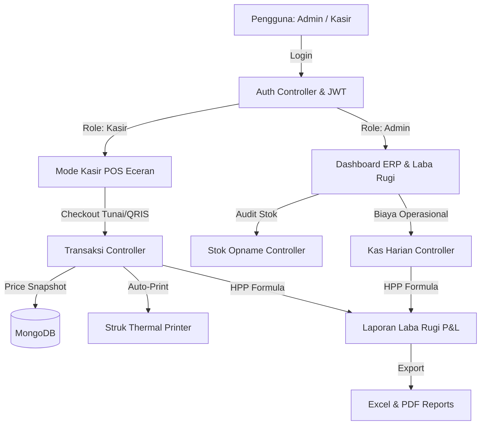

# 🏗️ Arsitektur & Alur Kerja System — Toko Kelontong Berkah (ERP & POS System)

> **Developed by jb with fixs** — *Speed • Security • Trust*  
> **Owner**: Fikri Rusdinerza

---

## 🧭 Overview Alur Kerja Sistem (End-to-End Workflow)

Aplikasi ini menggunakan arsitektur **Fullstack Decoupled (REST API + SPA)** yang dirancang untuk mengelola seluruh siklus operasional toko kelontong eceran secara real-time.

---

## 1. 🔑 Alur Authentifikasi & RBAC (Role-Based Access Control)
1. **Pengguna Membuka Aplikasi**: Sistem memeriksa `localStorage` untuk token JWT.
2. **Login Input**: Pengguna menginput `username` & `password`.
3. **Pemeriksaan Hash**: Backend mencocokkan password menggunakan `bcryptjs.compare()`.
4. **JWT Generation**: Backend menerbitkan JWT Token yang berisi `id`, `username`, dan `role` (`admin` / `kasir`).
5. **Pengarahan Tampilan**:
   - **Kasir**: Langsung diarahkan ke **Mode Kasir POS Eceran** dengan akses terbatas.
   - **Admin (Fikri Rusdinerza)**: Diarahkan ke **Sales Dashboard ERP** dengan akses penuh.

---

## 2. 🛒 Alur Transaksi Kasir POS & Snapshot Harga
1. **Pemilihan Barang**: Kasir menambahkan barang eceran ke Keranjang Belanja (*Cart*). Sistem memeriksa ketersediaan stok secara real-time.
2. **Snapshot Harga (Crucial for HPP)**:
   Saat checkout dieksekusi, sistem menyimpan:
   - `harga_saat_transaksi`: Harga jual pada detik transaksi dibuat.
   - `harga_modal_saat_transaksi`: Harga modal (HPP) pada detik transaksi dibuat.
   > **Tujuan**: Mencegah perubahan HPP historis di masa depan jika harga beli barang dari supplier naik/turun.
3. **Pengurangan Stok**: Stok barang di collection `Barang` otomatis berkurang sebanyak jumlah qty yang dibeli.

---

## 3. 📱 Alur Pembayaran QRIS BI (Alfamart Style)
1. **Pilih QRIS**: Kasir memilih metode `QRIS`.
2. **Display Modal QRIS BI**: Tampilan modal standar resmi **Bank Indonesia & GPN** muncul dengan barcode QR Code SVG dinamis dan nominal tagihan pas.
3. **Status Menunggu**: Sistem menampilkan status animasi `Menunggu Customer Scanning & Bayar...`.
4. **Notifikasi Payment Webhook / Chime**: Saat pembayaran terverifikasi:
   - Memutar suara audio chime POS kasir minimarket (*"Ding-Ding!"*).
   - Menampilkan badge hijau **PEMBAYARAN QRIS BERHASIL!**.
   - Otomatis memicu **Auto-Print Struk Thermal** tanpa klik manual.

---

## 4. 🖨️ Alur Cetak Struk Thermal Otomatis (Auto-Print)
1. **Trigger Modal Struk**: Modal `StrukThermalModal` muncul begitu transaksi sukses.
2. **Auto-Execution**: `useEffect` memicu `window.print()` dalam waktu 400ms.
3. **Format Layout**: Menggunakan CSS `@media print` khusus ukuran kertas 58mm / 80mm.

---

## 5. 📈 Alur Perhitungan Laba Rugi (P&L Formula)
Laporan Laba Rugi dihitung secara dinamis dari database menggunakan rumus:

$$\text{Laba Kotor} = \text{Total Pendapatan (Omset)} - \text{Total HPP (Snapshot Modal)}$$

$$\text{Laba Bersih} = \text{Laba Kotor} - \text{Total Biaya Operasional}$$

---

## 6. 📁 Alur Export Center (Excel & PDF)
- **Excel Export**: Menggunakan library `ExcelJS` untuk membuat lembaran kerja spreadsheet `.xlsx` berisi ringkasan finansial & detail transaksi.
- **PDF Export**: Menggunakan `PDFMake` untuk membuat dokumen laporan laba rugi format `.pdf` yang rapi dan printable.
